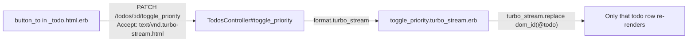

# Turbo Stream Priority Toggle Plan

## Data flow



---

## Slice A — Migration + model attribute

**New file:** generate with `bin/rails generate migration AddHighPriorityToTodos high_priority:boolean`

- In the generated file under `db/migrate/`, set `default: false, null: false` on the column.
- In [`app/models/todo.rb`](app/models/todo.rb), no extra code is needed — ActiveRecord exposes `high_priority` and `high_priority?` automatically from the column.
- Update [`test/fixtures/todos.yml`](test/fixtures/todos.yml): add `high_priority: false` to both `one` and `two` fixtures so existing tests keep working after the NOT NULL constraint lands.

---

## Slice B — Route + controller action

**[`config/routes.rb`](config/routes.rb)** — change `resources :todos` to:

```ruby
resources :todos do
  member do
    patch :toggle_priority
  end
end
```

This generates `toggle_priority_todo_path(todo)` → `PATCH /todos/:id/toggle_priority`.

**[`app/controllers/todos_controller.rb`](app/controllers/todos_controller.rb)**

- Add `:toggle_priority` to the `before_action :set_todo` list (line 2).
- Add a `toggle_priority` action after `destroy`:

```ruby
def toggle_priority
  @todo.update!(high_priority: !@todo.high_priority)
  respond_to do |format|
    format.turbo_stream
    format.html { redirect_to todos_path }
  end
end
```

No new `_params` method needed — `toggle_priority` takes no user-supplied attributes.

---

## Slice C — Turbo Stream view + toggle button in the partial

**New file: `app/views/todos/toggle_priority.turbo_stream.erb`**

Uses `turbo_stream.replace` targeting `dom_id(@todo)` to re-render only that row's partial:

```erb
<%= turbo_stream.replace dom_id(@todo) do %>
  <%= render @todo %>
<% end %>
```

**[`app/views/todos/_todo.html.erb`](app/views/todos/_todo.html.erb)**

Add a `button_to` inside the existing `<div id="<%= dom_id todo %>">` wrapper. The button label reflects the current state (e.g. "⭐" when high priority, "☆" when not). Because `button_to` submits a form, Turbo automatically adds `text/vnd.turbo-stream.html` to the `Accept` header:

```erb
<%= button_to todo.high_priority? ? "⭐" : "☆",
      toggle_priority_todo_path(todo),
      method: :patch %>
```

---

## Test

**[`test/controllers/todos_controller_test.rb`](test/controllers/todos_controller_test.rb)** — add two cases:

1. **Turbo Stream response** — `PATCH toggle_priority_todo_url(@todo)` with `Accept: text/vnd.turbo-stream.html` header; assert `response.media_type == "text/vnd.turbo-stream.html"` and `response` is `:success`.
2. **State is flipped** — assert `@todo.reload.high_priority` changed from `false` to `true` after the PATCH.

No new test files needed; both cases fit inside the existing `TodosControllerTest` class.
