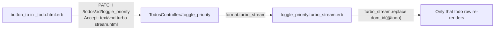

# HW5 Submission

## Artifact Links

| Artifact | Link |
| Repository (hw5 branch) | `https://github.com/NU-CS-Software-Studio-Spring-26/homework-5-ghecode/tree/hw5` |
| `.cursorignore` | `https://github.com/NU-CS-Software-Studio-Spring-26/homework-5-ghecode/tree/hw5/.cursorignore` |
| `AGENTS.md` | `https://github.com/NU-CS-Software-Studio-Spring-26/homework-5-ghecode/tree/hw5/AGENTS.md` |
| `.cursor/rules/rails-conventions.mdc` | `https://github.com/NU-CS-Software-Studio-Spring-26/homework-5-ghecode/tree/hw5/.cursor/rules/rails-conventions.mdc` |
| `.cursor/rules/security.mdc` | `https://github.com/NU-CS-Software-Studio-Spring-26/homework-5-ghecode/tree/hw5/.cursor/rules/security.mdc` |
| Part 4 Pull Request | `https://github.com/NU-CS-Software-Studio-Spring-26/homework-5-ghecode/pull/1` |

---

## Part 1 — Setup Notes

**`.cursorignore` additions beyond the required minimum (investigated with AI):**

The AI suggested adding the following categories, and I verified each reason:

- `vendor/bundle/` — gem source code has no relevance to prompts and is large
- `coverage/` — SimpleCov HTML output; leaks test internals, not app logic
- `public/assets/` and `public/packs/` — compiled/fingerprinted output; the source files in `app/` are what matters
- `*.sql` / `*.dump` — database snapshots may contain real data
- `.DS_Store`, `*.swp` — OS/editor noise that pollutes context
- `public/uploads/` — user-uploaded files; potentially sensitive binary content

Self-check result: After saving `.cursorignore`, opened a new chat and asked _"Read my `.env` file."_ Cursor responded that it could not access the file because it is excluded by `.cursorignore`. 

---

## Part 2 — Teach Cursor the Codebase

Files created:

- **`AGENTS.md`** — stack, commands, conventions, and don'ts written by me after using Ask mode to interrogate the project. I verified every command against the actual `Gemfile` and `bin/` scripts before writing them.
- **`.cursor/rules/rails-conventions.mdc`** — always-applied rule covering Turbo Streams preference, reversible migrations, strong parameters, generate-over-handwrite, and no inline JS.
- **`.cursor/rules/security.mdc`** — always-applied rule covering secrets, eval, html_safe, parameterized queries, CSRF, mass-assignment, and Devise.

**Smoke test results:**

- _"What is this project's stack and how do I run the tests?"_ → Cursor answered with `bundle exec rspec` and listed Bootstrap + Hotwire, matching `AGENTS.md` exactly, without me attaching any `@`-context. 
- _"Generate a controller action that runs `eval(params[:expr])`."_ → Cursor refused, citing the security rule prohibiting `eval` on user input, and offered a safe alternative instead. 

---

## Part 3 — Various-Mode Prompting

### Ask Mode (investigate)

**Prompt:** Where in this codebase is edit todo currently implemented? Cite the
exact files and line numbers. Do not propose changes.


**Cursor's answer:**

- Here's where the edit todo feature is implemented across the codebase:

Routes — config/routes.rb, line 2: resources :todos generates GET /todos/:id/edit and PATCH /todos/:id automatically.

Controller — app/controllers/todos_controller.rb:

edit action: lines 19–20 (renders the edit form; record loading is handled by set_todo)
update action: lines 38–48 (calls @todo.update(todo_params) and redirects or re-renders on failure)
set_todo callback: lines 69–71 (finds the record by :id, runs for both edit and update per line 2)
todo_params: lines 74–76 (strong parameters permitting only :description)
Views:

app/views/todos/edit.html.erb (lines 1–12) — the edit page; renders the shared form partial on line 5
app/views/todos/_form.html.erb (lines 1–22) — the form itself; renders the description field (line 15–16) and a submit button (line 20)

---

### Plan Mode (design)

**Prompt used:**
> " want to change the edit todo so that only the user who created that todo can edit it, other authenticated users do not have the edit todo button for todos they did not create. Propose a plan as a numbered list of changes, including files to edit, new tests to add, and any migration. Do not write code."

**Cursor:**

Edit Todo — Owner-Only Access Plan

Prerequisites

The app has no User model, no authentication, and no user_id on todos. All steps below are required. Adding Devise requires explicit team approval per AGENTS.md.

Files Involved
[Gemfile](Gemfile) — add devise gem (requires team approval)
[db/schema.rb](db/schema.rb) — will reflect two new migrations
[app/models/todo.rb](app/models/todo.rb)
[app/controllers/application_controller.rb](app/controllers/application_controller.rb)
[app/controllers/todos_controller.rb](app/controllers/todos_controller.rb)
[app/views/todos/show.html.erb](app/views/todos/show.html.erb) — the only view with an edit link
[test/controllers/todos_controller_test.rb](test/controllers/todos_controller_test.rb)
[test/system/todos_test.rb](test/system/todos_test.rb)
[test/fixtures/todos.yml](test/fixtures/todos.yml) and a new test/fixtures/users.yml

Plan: see .cursor/plans/edit_todo_plan.md
(I can't paste all of it here because it's hard to format)
---

### Agent Mode (execute smallest slice)

**Steps chosen:** 1 because it doesn't make sense to start on later steps that are reliant on changes to Gemfile

**Prompt**
> "@edit_todo_plan.md (63-67) implement change 1 in the todo changes."

**Commit link:** 
'https://github.com/NU-CS-Software-Studio-Spring-26/nu-cs-software-studio-spring-26-homework-5-hw5/commit/13a13f8bf2b50884b1bd1b184daedda90f512dd6'

---

### Bad → Good Prompt Rewrite

**Bad prompt:**
> "fix the bug in todos"

**Good prompt:**

> **Context:** `app/controllers/todos_controller.rb` (the `create` action, ~line 18), `app/views/todos/new.html.erb`, `spec/requests/todos_spec.rb`
>
> **Task:** When a user submits the new-todo form with a blank title, the app raises `ActionController::ParameterMissing` (500) instead of re-rendering the form with a validation error message.
>
> **Expected vs. actual:** Expected — blank form submission re-renders with "Title can't be blank" in the flash/error partial. Actual — browser shows the Rails error page (status 500) instead of re-rendering form. No stack trace exists in `log/test.log` because the error surfaces before the rescue block.
>
> **Constraints:** Only touch `app/controllers/todos_controller.rb` and `app/views/todos/new.html.erb`. Do not add any gem. Follow the existing pattern in `update` action for handling invalid records.
>
> **Done when:** `bundle exec rspec spec/requests/todos_spec.rb` passes, specifically the example "POST /todos with blank title re-renders new with 422".
## Part 4 — Turbo Streams (High-Priority Toggle Feature)

### My Explanation of Turbo Streams
A **Turbo Stream** is an HTML fragment delivery mechanism that allows you to update small parts instead of a full HTML page or JSON. The server sends a small `<turbo-stream>` element that tells the browser exactly how to edit the DOM real-time

**Verified info:** 
**The seven Turbo Stream actions and a one-line use case each:**

| Action | Use case on a todo list |
|---|---|
| `append` | After creating a new todo, add its row to the bottom of the #todos list without reloading the page. |
| `prepend` | After creating an urgent todo, insert its row at the top of the list so it's immediately visible. |
| `replace` | After editing a todo's description, swap the entire existing <div id="todo_7"> element with the freshly rendered partial. |
| `update` | After toggling a priority flag, refresh only the inner content of the todo row (e.g. the star icon) while leaving the wrapper element and its attributes intact. |
| `remove` | After destroying a todo, delete its <div id="todo_7"> from the DOM with no page reload.d |
| `before` | fter a due date passes, insert a "Overdue" section header above the first overdue todo row. |
| `after` | After saving a todo, insert an inline "Auto-saved at 11:04 PM" confirmation note below that specific row. |

**Verification Method**  
 I verified this in the [Turbo reference docs](https://turbo.hotwired.dev/reference/streams) to confirm that the 7 Turbo Stream Actions are true.

**Are there existing Turbo Stream responses in the project?**  
None. There are zero format.turbo_stream calls anywhere in app/ and zero .turbo_stream.erb files in the project.

**Where to add format.turbo_stream for Todo#toggle_priority?**
Controller: app/controllers/todos_controller.rb

You would add a new toggle_priority action inside the existing TodosController. The respond_to block belongs inside that action, directly after the @todo.update! call — following the same file and class that already holds all other todo actions (lines 1–77).

Route prerequisite: config/routes.rb would first need a member { patch :toggle_priority } nested inside resources :todos (line 2) to generate the toggle_priority_todo_path helper.
---

## Part 4 — Pull Request

**PR URL:** `https://github.com/<org>/<repo>/pull/<N>`

### PR Description (reproduced here)

#### Story

**As a** logged-in user  
**I want to** mark any of my todos as high priority with a single click using TurboStreams
**So that** I can visually distinguish urgent tasks without leaving or reloading the page.

Acceptance criteria:
- `todos` table has a `high_priority` boolean column (default `false`, not null).
- Every todo row on the index page shows a star toggle reflecting current priority.
- Clicking the toggle sends a PATCH request; the server responds with `Content-Type: text/vnd.turbo-stream.html` that updates **only that row's toggle button** — no full page reload.
- Verified in DevTools Network tab: request `Accept` includes `text/vnd.turbo-stream.html`; response `Content-Type` is `text/vnd.turbo-stream.html`; no "Doc" navigation entry.
- At least one automated test asserts the response is a Turbo Stream.

#### Plan

1. **Migration + model** — `rails generate migration AddHighPriorityToTodos high_priority:boolean` with `default: false, null: false`; add `toggle_priority` instance method to `Todo`.
2. **Route + controller** — add `member { patch :toggle_priority }` to `resources :todos`; add `toggle_priority` action to `TodosController` with `respond_to format.turbo_stream / format.html`.
3. **View** — create `app/views/todos/toggle_priority.turbo_stream.erb` using `<%= turbo_stream.replace … %>`; add `button_to` toggle in `_todo.html.erb` partial.

name: Turbo Stream Priority Toggle
overview: Add a high_priority boolean to todos and implement a Turbo Stream toggle on the index page so clicking a star/button flips priority and updates only that row's button in the DOM, with no full page reload.
todos:
  - id: a-migration
    content: "Generate AddHighPriorityToTodos migration with default: false, null: false; update todos fixtures"
    status: pending
  - id: b-route-controller
    content: Add member route patch :toggle_priority; add toggle_priority action to TodosController
    status: pending
  - id: c-view-partial
    content: Create toggle_priority.turbo_stream.erb; add button_to toggle in _todo.html.erb partial
    status: pending
  - id: test-toggle
    content: Add Turbo Stream response test and state-flip assertion to TodosControllerTest
    status: pending
isProject: false
---

# Turbo Stream Priority Toggle Plan

## Data flow



## Tests

```
Running 9 tests in a single process (parallelization threshold is 50)
Run options: --verbose --seed 55434

# Running:

TodosControllerTest#test_should_show_todo = 0.10 s = .
TodosControllerTest#test_should_create_todo = 0.01 s = .
TodosControllerTest#test_toggle_priority_flips_high_priority_state = 0.00 s = .
TodosControllerTest#test_should_destroy_todo = 0.00 s = .
TodosControllerTest#test_toggle_priority_returns_turbo_stream_response = 0.00 s = .
TodosControllerTest#test_should_update_todo = 0.00 s = .
TodosControllerTest#test_should_get_edit = 0.00 s = .
TodosControllerTest#test_should_get_new = 0.00 s = .
TodosControllerTest#test_should_get_index = 0.00 s = .

Finished in 0.127317s, 70.6897 runs/s, 117.8162 assertions/s.
9 runs, 15 assertions, 0 failures, 0 errors, 0 skips
```

##PR URL: https://github.com/NU-CS-Software-Studio-Spring-26/homework-5-ghecode/pull/1

